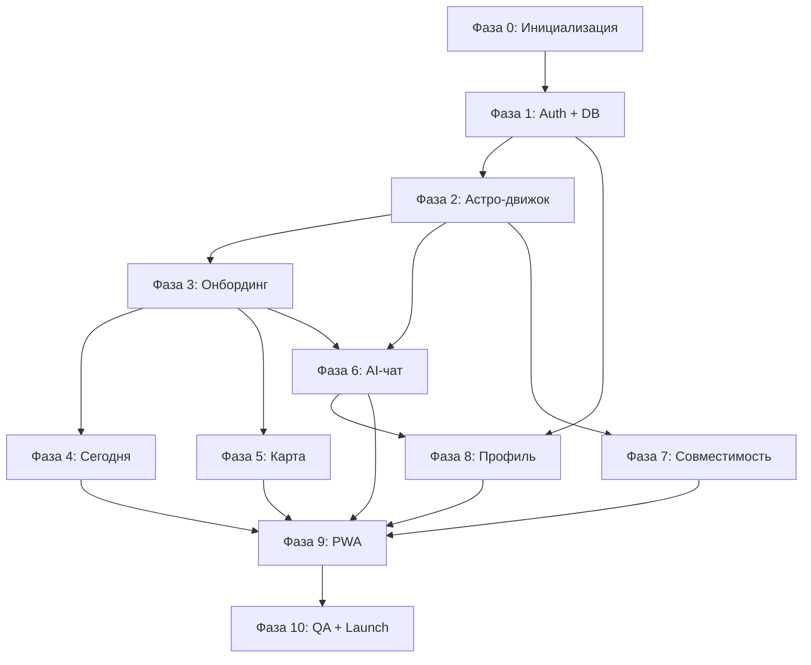

# Apex — MVP Implementation Plan

**Date:** 2026-06-07  
**Based on:** [2026-06-07-apex-astrology-design.md](./2026-06-07-apex-astrology-design.md)  
**Estimated total:** 6–8 недель (1 разработчик, part-time — 10–12 недель)

---

## Принципы выполнения

1. **Снизу вверх:** сначала расчёты и БД, потом UI — AI не должен «угадывать» астрологию.
2. **Один вертикальный срез за раз:** каждый шаг заканчивается работающей фичей, а не «половиной кода».
3. **Флаги премиума с первого дня:** даже без оплаты — `subscription_tier` в БД и проверки в API.
4. **Русский UI с первого коммита:** все строки через i18n-ключи (`ru` only в MVP).

---

## Обзор фаз

| Фаза | Название | Срок | Результат |
|---|---|---|---|
| 0 | Инициализация проекта | 1–2 дня | Repo, CI, env, деплой-заготовка |
| 1 | База и авторизация | 3–4 дня | Пользователь может войти |
| 2 | Астрологический движок | 4–5 дней | Натальная карта + транзиты по API |
| 3 | Онбординг | 2–3 дня | Сбор данных рождения |
| 4 | Экран «Сегодня» | 2–3 дня | Персональный гороскоп дня |
| 5 | Экран «Моя карта» | 3–4 дня | Визуализация карты |
| 6 | AI-чат + память | 5–6 дней | Чат с досье |
| 7 | Совместимость | 2–3 дня | 1 связь, ручной ввод |
| 8 | Профиль и freemium | 2–3 дня | Досье, лимиты, апселл |
| 9 | PWA и полировка | 2–3 дня | Установка, офлайн-оболочка |
| 10 | Тестирование и запуск | 3–4 дня | QA, staging, prod |

---

## Фаза 0: Инициализация проекта

**Цель:** рабочий скелет Next.js с инфраструктурой.

### Шаг 0.1 — Создать проект

- [ ] `npx create-next-app@latest apex --typescript --tailwind --app --src-dir`
- [ ] Настроить ESLint + Prettier
- [ ] Структура папок:

```
src/
  app/           # routes
  components/    # UI
  lib/
    astrology/   # расчёты
    ai/          # DeepSeek/Qwen клиент
    db/          # Supabase клиент
    i18n/        # русские строки
  types/
```

**Готово когда:** `npm run dev` открывает пустую страницу, `npm run build` проходит.

### Шаг 0.2 — Дизайн-система (минимализм)

- [ ] Tailwind: чёрный `#000`, белый `#fff`, серый `#888`, один accent
- [ ] Шрифт: Geist или Inter
- [ ] Базовые компоненты: `Button`, `Input`, `Card`, `TabBar`, `Layout`
- [ ] Тёмная тема по умолчанию (Co-Star стиль)

**Готово когда:** storybook или `/design` страница показывает все базовые компоненты.

### Шаг 0.3 — Env и деплой-заготовка

- [ ] `.env.example` с переменными:

```
NEXT_PUBLIC_SUPABASE_URL=
NEXT_PUBLIC_SUPABASE_ANON_KEY=
SUPABASE_SERVICE_ROLE_KEY=
DEEPSEEK_API_KEY=
QWEN_API_KEY=
GEOCODING_API_KEY=          # Nominatim или DaData
```

- [ ] Vercel project (или аналог) подключён к repo
- [ ] `git init` + первый коммит

**Готово когда:** push в main деплоит пустой сайт на staging URL.

---

## Фаза 1: База данных и авторизация

**Цель:** пользователь регистрируется и имеет профиль в БД.

### Шаг 1.1 — Supabase проект и схема

- [ ] Создать Supabase project
- [ ] Миграция `001_initial.sql`:

```sql
-- profiles (extends auth.users)
create table profiles (
  id uuid primary key references auth.users(id),
  name text,
  birth_date date,
  birth_time time,
  birth_place_name text,
  birth_lat double precision,
  birth_lng double precision,
  birth_timezone text,
  sun_sign text,
  moon_sign text,
  rising_sign text,
  subscription_tier text default 'free',  -- 'free' | 'premium'
  messages_today_count int default 0,
  messages_reset_date date default current_date,
  dossier jsonb default '[]'::jsonb,
  onboarding_completed boolean default false,
  created_at timestamptz default now()
);

-- natal_charts (cached computation)
create table natal_charts (
  id uuid primary key default gen_random_uuid(),
  user_id uuid references profiles(id) unique,
  chart_data jsonb not null,
  has_birth_time boolean default false,
  computed_at timestamptz default now()
);

-- compatibility_links
create table compatibility_links (
  id uuid primary key default gen_random_uuid(),
  user_id uuid references profiles(id),
  partner_name text not null,
  partner_birth_date date not null,
  partner_birth_time time,
  partner_birth_place_name text,
  partner_lat double precision,
  partner_lng double precision,
  partner_timezone text,
  synastry_data jsonb,
  created_at timestamptz default now()
);

-- chat_messages
create table chat_messages (
  id uuid primary key default gen_random_uuid(),
  user_id uuid references profiles(id),
  role text not null,  -- 'user' | 'assistant'
  content text not null,
  created_at timestamptz default now()
);

-- RLS policies для всех таблиц (user sees only own data)
```

**Готово когда:** миграция применена, RLS включён, тестовый insert через SQL editor работает.

### Шаг 1.2 — Auth: email magic link

- [ ] Supabase Auth: email provider
- [ ] Страницы `/login`, `/auth/callback`
- [ ] Middleware: редирект неавторизованных на `/login`
- [ ] Hook `useUser()` + server-side `getUser()`

**Готово когда:** пользователь входит по email, видит пустой dashboard.

### Шаг 1.3 — Auth: Telegram Login Widget

- [ ] Создать Telegram Bot через @BotFather
- [ ] Виджет на странице `/login`
- [ ] Верификация hash на сервере → создание/линковка Supabase user
- [ ] Сохранить `telegram_id` в profiles (добавить колонку)

**Готово когда:** вход через Telegram создаёт профиль и редиректит в приложение.

### Шаг 1.4 — Layout и навигация

- [ ] `AppLayout` с нижним TabBar (мобильный) / sidebar (десктоп)
- [ ] 5 вкладок: Сегодня, Карта, Совместимость, Чат, Профиль
- [ ] Заглушки страниц для каждой вкладки

**Готово когда:** авторизованный пользователь видит навигацию и может переключаться между пустыми экранами.

---

## Фаза 2: Астрологический движок

**Цель:** сервер точно считает натальную карту и транзиты. AI не участвует.

### Шаг 2.1 — Выбор и интеграция ephemeris

- [ ] Оценить: `sweph-wasm` / `astronomy-engine` / `circular-natal-horoscope-js`
- [ ] Рекомендация для MVP: **`circular-natal-horoscope-js`** (JS-native, проще в Next.js) или обёртка Swiss Ephemeris
- [ ] Модуль `src/lib/astrology/calculate.ts`:

```typescript
interface BirthData {
  date: string;       // YYYY-MM-DD
  time?: string;      // HH:MM или null
  lat: number;
  lng: number;
  timezone: string;
}

interface NatalChartResult {
  planets: PlanetPosition[];
  houses?: House[];
  aspects: Aspect[];
  hasBirthTime: boolean;
}
```

**Готово когда:** unit-тест сравнивает результат с известной картой (например, карта из astro.com).

### Шаг 2.2 — Геокодинг города

- [ ] API route `POST /api/geocode` — город → lat/lng/timezone
- [ ] DaData (для РФ городов) или Nominatim (бесплатно)
- [ ] Autocomplete компонент `CityInput` с debounce

**Готово когда:** ввод «Москва» возвращает `55.7558, 37.6173, Europe/Moscow`.

### Шаг 2.3 — Расчёт транзитов

- [ ] Модуль `src/lib/astrology/transits.ts`
- [ ] Вход: натальная карта + текущая дата
- [ ] Выход: массив активных аспектов (транзитная планета → натальная планета)

**Готово когда:** API `GET /api/transits?userId=` возвращает JSON с сегодняшними транзитами.

### Шаг 2.4 — Кэширование карты

- [ ] API `POST /api/chart/compute` — считает и сохраняет в `natal_charts`
- [ ] Пересчёт только при изменении birth data
- [ ] Обновление `sun_sign`, `moon_sign`, `rising_sign` в profiles

**Готово когда:** после вызова API карта лежит в БД и повторный запрос отдаёт кэш.

### Шаг 2.5 — Текстовое представление карты для AI

- [ ] Функция `chartToPrompt(chart, transits)` → компактная строка ~200 токенов:

```
Солнце: Скорпион, 12° | Луна: Рыбы, 28° | Асцендент: Дева
Транзиты: Сатурн квадрат натальная Луна (орб 1.2°)
```

**Готово когда:** функция покрыта тестом, output стабилен.

---

## Фаза 3: Онбординг

**Цель:** новый пользователь вводит данные рождения → карта считается.

### Шаг 3.1 — Wizard UI (3 шага)

- [ ] Шаг 1: имя + дата рождения (date picker)
- [ ] Шаг 2: город рождения (`CityInput` autocomplete)
- [ ] Шаг 3: время рождения (time picker) + кнопка «Не знаю» / Skip
- [ ] Прогресс-бар (3 точки)
- [ ] Валидация на каждом шаге

**Готово когда:** wizard проходится от начала до конца на мобильном без скролл-багов.

### Шаг 3.2 — Сохранение и расчёт

- [ ] `POST /api/onboarding/complete` — сохраняет в profiles, вызывает chart/compute
- [ ] `onboarding_completed = true`
- [ ] Редирект на `/today`

**Готово когда:** после онбординга в БД есть профиль + natal_chart.

### Шаг 3.3 — CTA «добавь время»

- [ ] Если `birth_time IS NULL` — баннер на экранах Карта и Сегодня
- [ ] Модалка / страница `/profile/birth-time` для дозаполнения
- [ ] При добавлении времени → пересчёт карты

**Готово когда:** пользователь без времени видит частичную карту и может добавить время позже.

---

## Фаза 4: Экран «Сегодня»

**Цель:** персональный гороскоп на текущий день.

### Шаг 4.1 — Генерация текста гороскопа

- [ ] API `GET /api/horoscope/today`
- [ ] Логика: транзиты → шаблонные ключевые темы → AI генерирует 2–3 предложения
- [ ] **Кэш на день:** один вызов AI на пользователя в сутки, результат в Redis/БД
- [ ] Fallback без AI: статический текст по главному транзиту

**Готово когда:** экран показывает уникальный текст, обновляется раз в сутки.

### Шаг 4.2 — UI экрана

- [ ] Приветствие: «Привет, {имя}»
- [ ] Карточка гороскопа (крупный текст, минимализм)
- [ ] Карточка главного транзита: «Сатурн □ твоя Луна»
- [ ] Pull-to-refresh (опционально)

**Готово когда:** экран выглядит как Co-Star Today — текст, не таблицы.

---

## Фаза 5: Экран «Моя карта»

**Цель:** визуальное колесо натальной карты + разбор планет.

### Шаг 5.1 — SVG-колесо карты

- [ ] Компонент `NatalChartWheel` — SVG:
  - внешнее кольцо: 12 знаков (текст, не иконки)
  - внутреннее: планеты как точки + символы (☉ ☽ ☿ ♀ ♂ ♃ ♄)
  - линии аспектов (тонкие, серые)
- [ ] Без домов если нет birth_time
- [ ] Responsive: масштабируется на мобильном

**Готово когда:** колесо рендерится для тестовой карты, читаемо на iPhone SE.

### Шаг 5.2 — Список планет

- [ ] Под колесом: таблица планет в знаках и градусах
- [ ] «Большая тройка» выделена: Солнце, Луна, Асцендент
- [ ] Freemium: без времени — только Солнце и планеты, без домов и аспектов
- [ ] Premium badge на заблокированных секциях (без реальной оплаты — заглушка)

**Готово когда:** бесплатный пользователь видит базовую карту, премиум-секции помечены.

---

## Фаза 6: AI-чат + память

**Цель:** диалог с виртуальным астрологом, который помнит пользователя.

### Шаг 6.1 — AI-клиент

- [ ] `src/lib/ai/client.ts` — OpenAI-compatible wrapper
- [ ] Провайдеры: DeepSeek (primary), Qwen (fallback)
- [ ] Автопереключение при ошибке/таймауте
- [ ] Token counting + лимит на ответ (max 500 tokens)

**Готово когда:** `aiClient.chat(messages)` возвращает ответ на русском.

### Шаг 6.2 — System prompt

- [ ] Файл `src/lib/ai/prompts/astrologer.ts`
- [ ] Co-Star тон на русском: прямо, честно, без воды и токсичного позитива
- [ ] Плейсхолдеры: `{chart}`, `{transits}`, `{dossier}`, `{userName}`
- [ ] Инструкция: «Ты интерпретируешь данные, не выдумываешь позиции планет»

**Готово когда:** 5 тестовых промптов дают ответы в нужном тоне (ручная проверка).

### Шаг 6.3 — API чата

- [ ] `POST /api/chat` — принимает message, возвращает stream или JSON
- [ ] Собирает контекст: chart + transits + dossier + last 10 messages
- [ ] Сохраняет user message и assistant reply в `chat_messages`
- [ ] Инкремент `messages_today_count`
- [ ] Проверка лимита: free ≤ 5/день, сброс по `messages_reset_date`

**Готово когда:** сообщение → ответ с учётом карты, счётчик растёт.

### Шаг 6.4 — UI чата

- [ ] Компонент `ChatWindow` — лента сообщений
- [ ] User справа, AI слева (минимализм, без аватаров)
- [ ] Input внизу + кнопка отправки
- [ ] Индикатор «печатает...»
- [ ] При лимите: inline «Лимит на сегодня исчерпан» + кнопка «Премиум»

**Готово когда:** полный цикл отправки работает на мобильном.

### Шаг 6.5 — Досье (память Tier 1)

- [ ] `POST /api/dossier/update` — вызывается:
  - после 5+ сообщений в сессии, ИЛИ
  - при уходе со страницы чата (beforeunload / visibility API)
- [ ] Промпт: «Извлеки новые факты о пользователе из диалога»
- [ ] Merge с существующим dossier (JSONB array of facts)
- [ ] Дедупликация похожих фактов

**Готово когда:** после разговора «у меня проблемы на работе» факт появляется в dossier и влияет на следующий ответ.

### Шаг 6.6 — Первый визит в чат

- [ ] Если dossier пустой → AI отправляет приветствие с 2 вопросами:
  - «Что сейчас больше всего волнует?»
  - «Есть кто-то, о ком хочешь спросить?»
- [ ] Не ждёт ввода пользователя — auto-message при открытии чата

**Готово когда:** новый пользователь видит персональное приветствие, не пустой экран.

---

## Фаза 7: Совместимость

**Цель:** пользователь добавляет 1 человека и видит совместимость.

### Шаг 7.1 — Форма добавления

- [ ] Страница `/compatibility/add`
- [ ] Поля: имя, дата рождения, время (опц.), город (опц.)
- [ ] Freemium: max 1 связь для free — проверка в API

**Готово когда:** форма сохраняет `compatibility_links` и считает карту партнёра.

### Шаг 7.2 — Расчёт совместимости

- [ ] Модуль `src/lib/astrology/synastry.ts`
- [ ] Вход: две натальные карты
- [ ] Выход: ключевые аспекты (Солнце–Солнце, Луна–Луна, Венера–Марс) + score
- [ ] AI генерирует 3–4 предложения интерпретации (кэш)

**Готово когда:** API возвращает совместимость с текстом на русском.

### Шаг 7.3 — UI списка

- [ ] Список связей с именем и знаком Солнца
- [ ] Тап → детальная страница совместимости
- [ ] Пустое состояние: «Добавь человека, чтобы узнать совместимость»

**Готово когда:** полный flow: добавить → увидеть результат.

---

## Фаза 8: Профиль и freemium

**Цель:** пользователь управляет данными, досье и видит лимиты.

### Шаг 8.1 — Страница профиля

- [ ] Имя, дата/время/место рождения (редактируемые)
- [ ] Текущий план: Free / Premium (заглушка)
- [ ] Счётчик: «Сообщений сегодня: 3/5»
- [ ] Кнопка выхода

**Готово когда:** редактирование birth data пересчитывает карту.

### Шаг 8.2 — Экран досье

- [ ] `/profile/memory` — «Что Apex знает обо мне»
- [ ] Список фактов из dossier JSONB
- [ ] Редактирование и удаление каждого факта
- [ ] Кнопка «Очистить всю память»

**Готово когда:** пользователь видит и контролирует факты из чата.

### Шаг 8.3 — Freemium gates (без оплаты)

- [ ] Middleware/helper `checkFeatureAccess(user, feature)`
- [ ] Блокировки:
  - chart: дома и аспекты → premium
  - compatibility: >1 связь → premium
  - chat: >5 msg/day → premium
- [ ] UI: `PremiumBadge` + `UpgradeCTA` (ведёт на `/premium` заглушку)

**Готово когда:** free-пользователь упирается в лимиты, видит понятный апселл.

### Шаг 8.4 — Captcha на регистрацию

- [ ] hCaptcha или Cloudflare Turnstile на `/login`
- [ ] Проверка на сервере при создании сессии

**Готово когда:** бот не может массово регистрироваться.

---

## Фаза 9: PWA и полировка

**Цель:** сайт можно «установить» на телефон, готов к push в фазе 2.

### Шаг 9.1 — PWA manifest

- [ ] `public/manifest.json` — name: Apex, theme: black
- [ ] Иконки 192×192, 512×512 (минималистичная «A»)
- [ ] `next-pwa` или ручной service worker

**Готово когда:** Chrome предлагает «Установить приложение».

### Шаг 9.2 — Service Worker (оболочка)

- [ ] Кэш статики (JS, CSS, fonts)
- [ ] Offline fallback page: «Нет сети»
- [ ] Заготовка под Web Push (пустой handler)

**Готово когда:** приложение открывается offline с заглушкой.

### Шаг 9.3 — SEO и мета

- [ ] `layout.tsx` metadata на русском
- [ ] Open Graph для шеринга
- [ ] `/` landing page для неавторизованных (1 экран + CTA «Начать»)

**Готово когда:** ссылка в Telegram красиво превьюится.

### Шаг 9.4 — Финальная полировка UI

- [ ] Анимации переходов между табами (subtle)
- [ ] Loading skeletons на всех экранах
- [ ] Error boundaries с русскими сообщениями
- [ ] 404 / 500 страницы

**Готово когда:** нет «белых экранов» при загрузке и ошибках.

---

## Фаза 10: Тестирование и запуск

**Цель:** уверенность в качестве перед показом пользователям.

### Шаг 10.1 — Unit-тесты

- [ ] `calculate.ts` — 3 эталонных карты
- [ ] `transits.ts` — известные транзиты на дату
- [ ] `synastry.ts` — пара карт → ожидаемые аспекты
- [ ] `chartToPrompt.ts` — стабильный output
- [ ] `dossier merge` — дедупликация фактов

**Готово когда:** `npm test` зелёный, coverage > 70% на astrology модуле.

### Шаг 10.2 — Integration-тесты

- [ ] onboarding → chart in DB
- [ ] chat message → response + count increment
- [ ] chat session end → dossier updated
- [ ] free user 6th message → 429

**Готово когда:** `npm run test:integration` зелёный.

### Шаг 10.3 — E2E (Playwright)

- [ ] Полный flow: login → onboarding → today → chart → chat → compatibility
- [ ] Mobile viewport (375×812)

**Готово когда:** E2E проходит на staging.

### Шаг 10.4 — Ручной QA

- [ ] 5 тестовых пользователей с разными картами
- [ ] Чеклист:
  - [ ] AI тон — прямой, не слащавый
  - [ ] Память — помнит факты через 10 сообщений
  - [ ] Карта без времени — корректная частичная
  - [ ] Лимит 5 сообщений — понятный апселл
  - [ ] Мобильный UX — все экраны без горизонтального скролла

**Готово когда:** нет блокеров, список minor bugs задокументирован.

### Шаг 10.5 — Запуск

- [ ] Production env vars на Vercel
- [ ] Supabase production project
- [ ] Домен подключён
- [ ] Мониторинг: Sentry для ошибок
- [ ] Analytics: Plausible или Umami (privacy-friendly)

**Готово когда:** сайт доступен по домену, Sentry ловит ошибки.

---

## Зависимости между фазами



**Критический путь:** 0 → 1 → 2 → 3 → 6 → 8 → 10

Фазы 4, 5, 7 можно параллелить после фазы 3.

---

## Что сознательно НЕ в MVP

| Фича | Почему отложено |
|---|---|
| Оплата / ЮKassa | Нет смысла до валидации retention |
| Web Push | Нужен стабильный контент сначала |
| pgvector память | Досье достаточно для старта |
| Invite-by-link | Нужна база пользователей |
| Google OAuth | Telegram + email хватит для RU |
| Нативное приложение | PWA покрывает 80% |

---

## Следующий шаг

Начать с **Фазы 0, Шаг 0.1** — инициализация Next.js проекта.

Скажи «начинаем» — и я создам проект.
